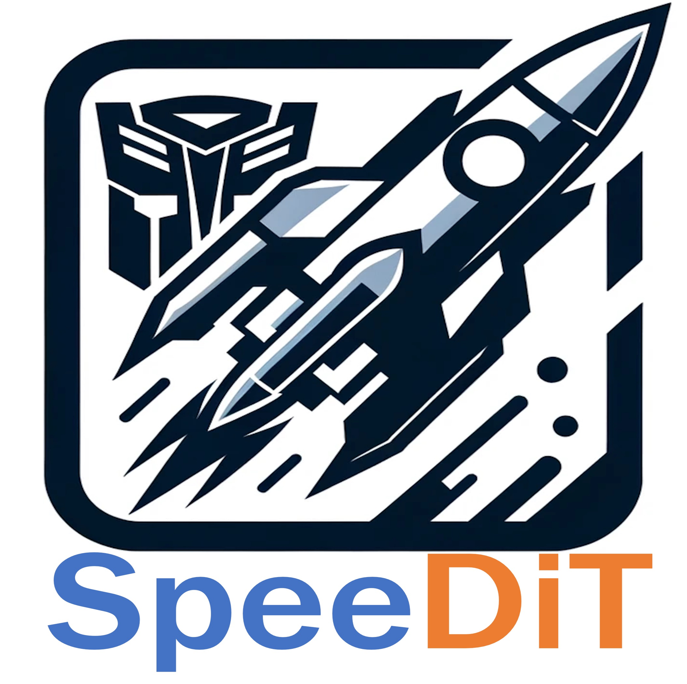
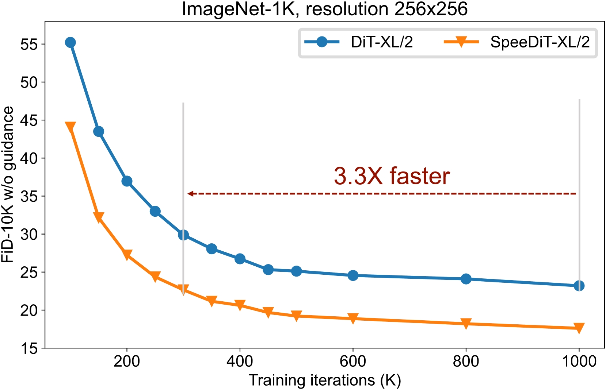
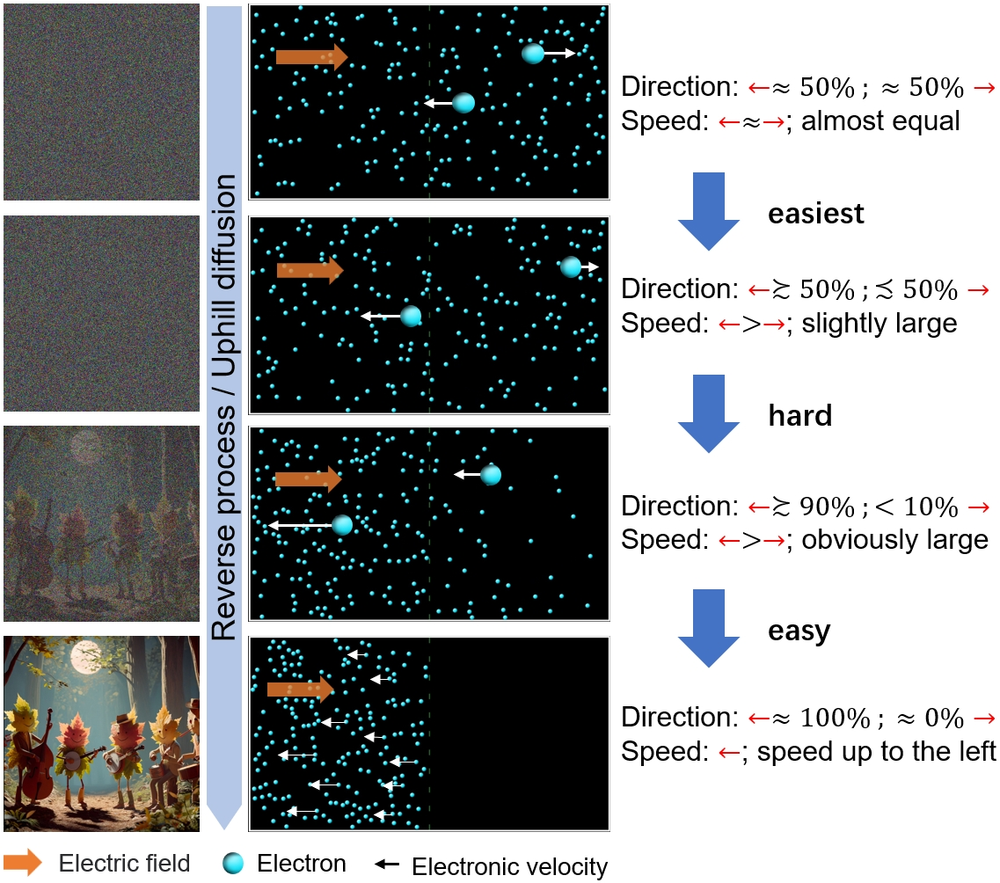

<p align="center">
    


<p>
<h2 align="center">SpeeDiT: Accelerating DiTs and General Diffusion Models via Principle Timestep Adjustment Training
<h5 align="center"> If you like SpeeDiT, please give us a star ⭐ on GitHub for the latest update.
</h2>

## Authors


- Yukun Zhou<sup>1,2</sup>, [Kai Wang+](https://kaiwang960112.github.io/)<sup>2</sup>, [Hanwang Zhang*](https://personal.ntu.edu.sg/hanwangzhang/)<sup>3</sup>, [Yang You*](https://www.comp.nus.edu.sg/~youy/)<sup>2</sup>, and [Xiaojiang Peng*](https://pengxj.github.io/)<sup>1</sup>(+ project lead, * advising contribution)
- <sup>1</sup>[Shenzhen Technology University](https://english.sztu.edu.cn/), <sup>2</sup>[National University of Singapore](https://nus.edu.sg/), and <sup>3</sup>[Nanyang Technological University](https://www.ntu.edu.sg/)

## Elevator roadshow of SpeeDiT

We propose a general diffusion training acceleration algorithm that employs asymmetric sampling of time steps, named SpeeDiT. It can speed up DiT by 3.3 times without a decrease in FID. Ongoing experiments demonstrate that SpeeDiT can be applied to multiple diffusion-based visual generation tasks and has good compatibility with other acceleration methods. Therefore, we believe SpeeDiT can significantly reduce the cost of diffusion training, allowing more people to benefit from this exciting technological advancement!

### TODO list sorted by priority

 If you encounter any inconvenience with the code or have suggestions for improvements, please feel free to contact us via email at ykzhou8981389@gmail.com and kai.wang@comp.nus.edu.sg.

* [ ] Releasing SpeeDiT-XL/2 [400K](https://huggingface.co/1zeryu/SpeeDiT_XL-2_400K), 1000K, ..., 7000K checkpoints and public the technical report.

* [ ] Upgrading the components of SpeeDiT

* [ ] Applying SpeeDiT to text2image

  ​	[[Stable diffusion](https://github.com/Stability-AI/stablediffusion.git)]

  ​	[[Latent Diffusion](https://github.com/CompVis/latent-diffusion)]

  ​	[[Imagen](https://imagen.research.google/)]

* [ ] Applying SpeeDiT to text2video

  ​	[[Open-Sora](https://github.com/hpcaitech/Open-Sora/tree/main?tab=readme-ov-file)]

  ​	[[Latte](https://github.com/Vchitect/Latte)]

* [ ] SpeeDiT + [MDT](https://github.com/sail-sg/MDT)

* [ ] More tasks (Image inpainting, 3D Generation)

## 😮 Highlights

Our method, which is easily compatible, can accelerate the training of diffusion model.




##  ✒️ Motivation

Inspired by the uphill and downhill diffusion processes in physics. The following GIF illustrates the  commonalities  between image diffusion and electron diffusion. The left  figure of electric diffusion is simulated from  [PhET/diffusion](https://phet.colorado.edu/zh_CN/simulations/diffusion). The right figure is downloaded from [OpenAI website](https://images.openai.com/blob/b196df3a-6fea-4d86-87b2-f9bb50be64c7/leaf.png?trim=0,0,0,0&width=2600).

Visualization of different phases of reverse process and [uphill diffusion](https://en.wikipedia.org/wiki/Diffusion). For easy understanding, we assume that the direction of electronic velocity only has two cases: :arrow_left: and :arrow_right:.



##  🔆 Method

We use the sampling and weighting strategy which are simple and easily compatible to achieve the acceleration. The following is the core code  [SpeeDiT/speedit/diffusion/iddpm/speed.py](https://github.com/1zeryu/SpeeDiT/blob/master/speedit/diffusion/iddpm/speed.py) ,

```python
class SpeeDiffusion(SpacedDiffusion):
    def __init__(self, faster, **kwargs):
        super().__init__(**kwargs)
        self.faster = faster
        if faster:
            grad = np.gradient(self.sqrt_one_minus_alphas_cumprod)

            # set the meaningful steps in diffusion, which is more important in inference
            self.meaningful_steps = np.argmax(grad < 1e-4) + 1

            # p2 weighting from: Perception Prioritized Training of Diffusion Models
            self.p2_gamma = 1
            self.p2_k = 1
            self.snr = 1.0 / (1 - self.alphas_cumprod) - 1
            sqrt_one_minus_alphas_bar = torch.from_numpy(self.sqrt_one_minus_alphas_cumprod)
            # sample more meaningful step
            p = torch.tanh(1e6 * (torch.gradient(sqrt_one_minus_alphas_bar)[0] - 1e-4)) + 1.5
            self.p = F.normalize(p, p=1, dim=0)
        else:
            self.meaningful_steps = self.num_timesteps

    def _weights(self):
        # process where all noise to noisy image with content has more weighting in training
        # the weights act on the mse loss
        weights =  1 / (self.p2_k + self.snr) ** self.p2_gamma
        weights = weights
        return weights

    # get the weights and sampling t in training diffusion
    def t_sample(self, n, device):
        if self.faster:
            t = torch.multinomial(self.p, n // 2 + 1, replacement=True).to(device)
            # dual sampling, which can balance the step multiple task training
            dual_t = torch.where(t < self.meaningful_steps, self.meaningful_steps - t, t - self.meaningful_steps)
            t = torch.cat([t, dual_t], dim=0)[:n]
            weights = self._weights()
        else:
            # if
            t = torch.randint(0, self.num_timesteps, (n,), device=device)
            weights = None

        return t, weights
```

 You can enable our acceleration module with **diffusion.faster=True**.

```
# config file
diffusion:
    timestep_respacing: '250'
    faster: true  #enabl module for training acceleration
```


## 🛠️ Requirements and Installation

This code base does not use hardware acceleration technology, experimental environment is not complicated.

You can create a new conda environment:

```
conda env create -f environment.yml
conda activate speedit
```

or install the necessary package by:

```
pip install -r requirements.txt
```

If necessary, we will provide more methods (e.g., docker) to facilitate the configuration of the experimental environment.

## 🗝️ Implementation

We provide a complete process for generating tasks including **training**, **inference** and **test**. The current code is only compatible with class-conditional image generation tasks. We will be compatible with more generation tasks about diffusion in the future.

We refactor the [facebookresearch/DiT](https://github.com/facebookresearch/DiT) code and loaded the configs using  [OmegaConf ](https://omegaconf.readthedocs.io/en/2.3_branch/). The configuration file loading rule is  recursive for easier argument modification. Simply put, the file in the latter path will override the previous setting of **base.yaml**.

You can modify the experiment setting by modifying the config file and the command line. More details about the reading of config are written in  [configs/README.md](https://github.com/1zeryu/SpeeDiT/blob/master/configs/README.md).

For each experiment, you must provide two arguments by command,

```
-c: config path;
-p: phase including ['train', 'inference', 'sample'].
```

### Train & inference

For example, class-conditional image generation task with 256x256 ImageNet dataset and DiT-XL/2 models.

```bash
# Training: training diffusion and saving checkpoints
torchrun --nproc_per_node=8 main.py -c configs/image/imagenet_256/base.yaml -p train
# inference: generating samples for testing
torchrun --nproc_per_node=8 main.py -c configs/image/imagenet_256/base.yaml -p inference
# sample: sample some images for visualization
python main.py -c configs/image/imagenet_256/base.yaml -p sample
```

**How to do ablation?**

You can modify the experiment setting by modifying the config file and the command line. More details about the reading of config are written in  [configs/README.md](https://github.com/1zeryu/SpeeDiT/blob/master/configs/README.md).

For example,  change the classifier-free guidance scale in sampling by command line:

```
python main.py -c configs/image/imagenet_256/base.yaml -p sample guidance_scale=1.5
```

### Test

Test the generation tasks require the results of inference. The more details about testing in  [evaluations](https://github.com/1zeryu/SpeeDiT/tree/master/evaluations).

## 👍 Acknowledgement

We are grateful for the following exceptional work and generous contribution to open source.

* [DiT](https://github.com/facebookresearch/DiT): Scalable Diffusion Models with Transformers.
* [Open-Sora](https://github.com/hpcaitech/Open-Sora/tree/main) : Open-Sora: Democratizing Efficient Video Production for All
* [OpenDiT](https://github.com/NUS-HPC-AI-Lab/OpenDiT): An acceleration for DiT training. We adopt valuable acceleration strategies for training progress from OpenDiT.

## 🔒 License

The majority of this project is released under the Apache 2.0 license as found in the [LICENSE](https://github.com/PKU-YuanGroup/Video-LLaVA/blob/main/LICENSE) file.

## ✏️Citation

 If you find our code useful in your research, please consider giving a star ⭐ and citation 📝.

```
@software{speedit,
  author = {Yukun Zhou, Kai Wang, Hanwang Zhang, Yang You and Xiaojiang Peng},
  title = {SpeeDiT: Accelerating DiTs and General Diffusion Models via Principle Timestep Adjustment Training},
  month = {March},
  year = {2024},
  url = {https://github.com/1zeryu/SpeeDiT}
}
```
