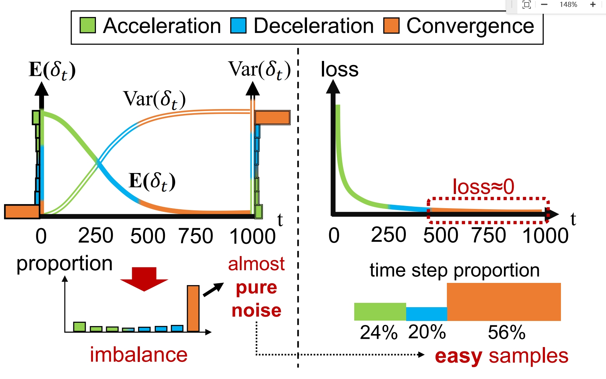
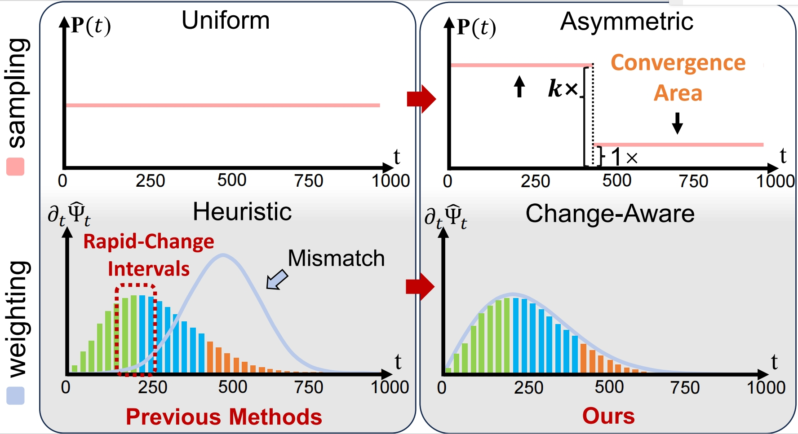

<p align="center">
    


<p>
<h2 align="center">A Closer Look at Time Steps is Worthy of Triple Speed-Up for Diffusion Model Training
<h5 align="center"> If you like SpeeD, please give us a star ⭐ on GitHub for the latest update.
</h2>

### [Paper](https://arxiv.org/pdf/2405.17403) | [Project Page](https://bdemo.github.io/SpeeD/) | [Hugging Face]()

This repository contains the code and implementation details for the research paper titled "A Closer Look at Time Steps is Worthy of Triple Speed-Up for Diffusion Model Training." In this paper, SpeeD, a novel speed-up method for diffusion model training, is introduced.

## Authors

- [Kai Wang](https://kaiwang960112.github.io/)<sup>2</sup>, Yukun Zhou<sup>1,2</sup>, [Mingjia Shi](https://www.samjs.online/)<sup>2</sup>, [Zhihang Yuan](https://zhihang.cc/)<sup>3</sup>, [Yuzhang Shang](https://42shawn.github.io/)<sup>4</sup>, [Xiaojiang Peng*](https://pengxj.github.io/)<sup>1</sup>, [Hanwang Zhang](https://personal.ntu.edu.sg/hanwangzhang/)<sup>5</sup>, [Yang You](https://www.comp.nus.edu.sg/~youy/)<sup>2</sup>
- <sup>1</sup>[Shenzhen Technology University](https://english.sztu.edu.cn/), <sup>2</sup>[National University of Singapore](https://nus.edu.sg/), <sup>3</sup>[Infinigence-AI](https://cloud.infini-ai.com/), <sup>4</sup>[Illinois Institute of Technology](https://www.iit.edu/), and <sup>5</sup>[Nanyang Technological University](https://www.ntu.edu.sg/) [Kai, Yukun, and Mingjia contribute equally to this work. We will update this repo asap.]

## 😮 Highlights

Our method, which is easily compatible, can accelerate the training of diffusion model.


##  ✒️ Motivation
<!-- 
Inspired by the uphill and downhill diffusion processes in physics. The following GIF illustrates the  commonalities  between image diffusion and electron diffusion. The left  figure of electric diffusion is simulated from  [PhET/diffusion](https://phet.colorado.edu/zh_CN/simulations/diffusion). The right figure is downloaded from [OpenAI website](https://images.openai.com/blob/b196df3a-6fea-4d86-87b2-f9bb50be64c7/leaf.png?trim=0,0,0,0&width=2600).

Visualization of different phases of reverse process and [uphill diffusion](https://en.wikipedia.org/wiki/Diffusion). For easy understanding, we assume that the direction of electronic velocity only has two cases: :arrow_left: and :arrow_right:.

 -->

Inspired by the following observation on time steps, we propose the re-sampling + re-weighting strategy as shown below.

To take a closer look at time steps, we find that the time steps could be divided into three areas: acceleration, decceleration and convergence areas. Samples of the corresponding time step in the convergence area are of limited benefit to training, while these time steps take up the most. Empirically, the training losses of these samples are quite low compare to the ones of the other two areas.


Asymmetric Sampling: Suppress the attendance of the time step in convergence areas.

Change-Aware Weighting: The faster changing time steps in the diffusion process are given more weight.


<!-- ##  🔆 Method

We use the sampling and weighting strategy which are simple and easily compatible to achieve the acceleration. The following is the core code  [SpeeD/speed/diffusion/iddpm/speed.py](https://github.com/kaiwang960112/SpeeD/blob/master/speed/diffusion/iddpm/speed.py) ,

```python
class SpeeDiffusion(SpacedDiffusion):
    def __init__(self, faster, **kwargs):
        super().__init__(**kwargs)
        self.faster = faster
        if faster:
            grad = np.gradient(self.sqrt_one_minus_alphas_cumprod)

            # set the meaningful steps in diffusion, which is more important in inference
            self.meaningful_steps = np.argmax(grad < 1e-4) + 1

            # p2 weighting from: Perception Prioritized Training of Diffusion Models
            self.p2_gamma = 1
            self.p2_k = 1
            self.snr = 1.0 / (1 - self.alphas_cumprod) - 1
            sqrt_one_minus_alphas_bar = torch.from_numpy(self.sqrt_one_minus_alphas_cumprod)
            # sample more meaningful step
            p = torch.tanh(1e6 * (torch.gradient(sqrt_one_minus_alphas_bar)[0] - 1e-4)) + 1.5
            self.p = F.normalize(p, p=1, dim=0)
            self.weights = self._weights()
        else:
            self.meaningful_steps = self.num_timesteps

    def _weights(self):
        # process where all noise to noisy image with content has more weighting in training
        # the weights act on the mse loss
        weights =  1 / (self.p2_k + self.snr) ** self.p2_gamma
        weights = weights
        return weights

    # get the weights and sampling t in training diffusion
    def t_sample(self, n, device):
        if self.faster:
            t = torch.multinomial(self.p, n // 2 + 1, replacement=True).to(device)
            # dual sampling, which can balance the step multiple task training
            dual_t = torch.where(t < self.meaningful_steps, self.meaningful_steps - t, t - self.meaningful_steps)
            t = torch.cat([t, dual_t], dim=0)[:n]
            weights = self.weights
        else:
            # if
            t = torch.randint(0, self.num_timesteps, (n,), device=device)
            weights = None

        return t, weights
```

 You can enable our acceleration module with **diffusion.faster=True**.

```
# config file
diffusion:
    timestep_respacing: '250'
    faster: true  #enabl module for training acceleration
``` -->


## 🛠️ Requirements and Installation

This code base does not use hardware acceleration technology, experimental environment is not complicated.

You can create a new conda environment:

```
conda env create -f environment.yml
conda activate speed
```

or install the necessary package by:

```
pip install -r requirements.txt
```

If necessary, we will provide more methods (e.g., docker) to facilitate the configuration of the experimental environment.

## 🗝️ Tutorial

We provide a complete process for generating tasks including **training**, **inference** and **test**. The current code is only compatible with class-conditional image generation tasks. We will be compatible with more generation tasks about diffusion in the future.

We refactor the [facebookresearch/DiT](https://github.com/facebookresearch/DiT) code and loaded the configs using  [OmegaConf ](https://omegaconf.readthedocs.io/en/2.3_branch/). The configuration file loading rule is  recursive for easier argument modification. Simply put, the file in the latter path will override the previous setting of **base.yaml**.

You can modify the experiment setting by modifying the config file and the command line. More details about the reading of config are written in  [configs/README.md](https://github.com/kaiwang960112/SpeeD/blob/master/configs/README.md).

For each experiment, you must provide two arguments by command,

```
-c: config path;
-p: phase including ['train', 'inference', 'sample'].
```

### Train & inference

**Baseline**

Class-conditional image generation task with 256x256 ImageNet dataset and DiT-XL/2 models.

```bash
# Training: training diffusion and saving checkpoints
torchrun --nproc_per_node=8 main.py -c configs/image/imagenet_256/base.yaml -p train
# inference: generating samples for testing
torchrun --nproc_per_node=8 main.py -c configs/image/imagenet_256/base.yaml -p inference
# sample: sample some images for visualization
python main.py -c configs/image/imagenet_256/base.yaml -p sample
```

**Ablation**

You can modify the experiment setting by modifying the config file and the command line. More details about the configs are in [configs/README.md](https://github.com/kaiwang960112/SpeeD/blob/master/configs/README.md).

For example,  change the classifier-free guidance scale in sampling by command line:

```
python main.py -c configs/image/imagenet_256/base.yaml -p sample guidance_scale=1.5
```

### Test

Test the generation tasks require the results of inference. The more details about testing in  [evaluations](https://github.com/kaiwang960112/SpeeD/tree/master/evaluations).

## 🔒 License

The majority of this project is released under the Apache 2.0 license as found in the [LICENSE](https://github.com/PKU-YuanGroup/Video-LLaVA/blob/main/LICENSE) file.

## ✏️Citation

 If you find our code useful in your research, please consider giving a star ⭐ and citation 📝.

```
@article{wang2024closer,
      title={A Closer Look at Time Steps is Worthy of Triple Speed-Up for Diffusion Model Training}, 
      author={Kai Wang, Yukun Zhou, Mingjia Shi, Zhihang Yuan, Yuzhang Shang, Xiaojiang Peng, Hanwang Zhang and Yang You},
      year={2024},
      journal={arXiv preprint arXiv:2405.17403},
}
```

## 👍 Acknowledgement

We thank Tianyi Li, Yuchen Zhang, Yuxin Li, Zhaoyang Zeng, and Yanqing Liu for the comments on this work. Kai Wang (idea, writing, story, presentation), Yukun Zhou (implementation), and Mingjia Shi (theory, writing, presentation) contribute equally to this work. Xiaojiang Peng, Hanwang Zhang, and Yang You are equal advising. Xiaojiang Peng is the corresponding author.

We are grateful for the following exceptional work and generous contribution to open source.

* [DiT](https://github.com/facebookresearch/DiT): Scalable Diffusion Models with Transformers.
* [Open-Sora](https://github.com/hpcaitech/Open-Sora/tree/main) : Open-Sora: Democratizing Efficient Video Production for All
* [OpenDiT](https://github.com/NUS-HPC-AI-Lab/OpenDiT): An acceleration for DiT training. We adopt valuable acceleration strategies for training progress from OpenDiT.
